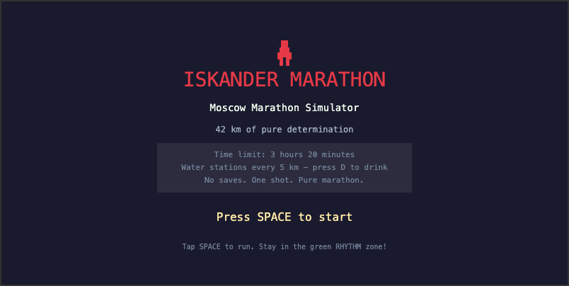
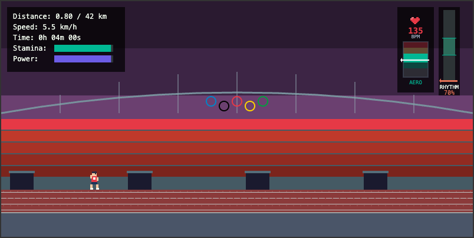
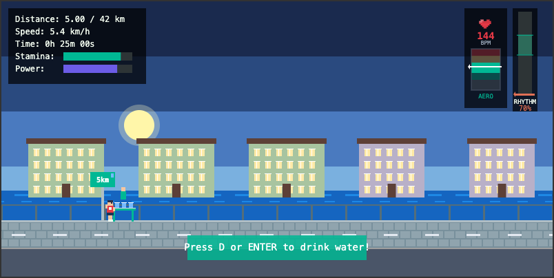
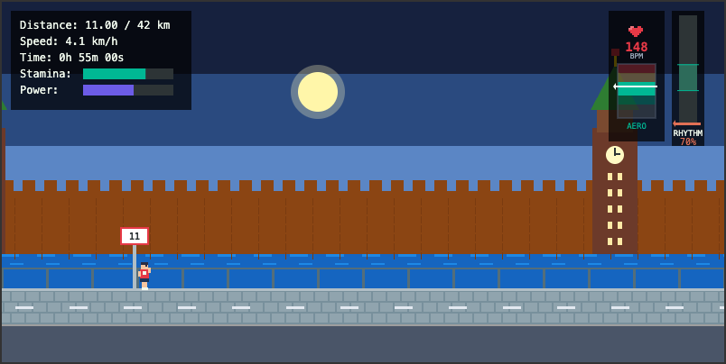
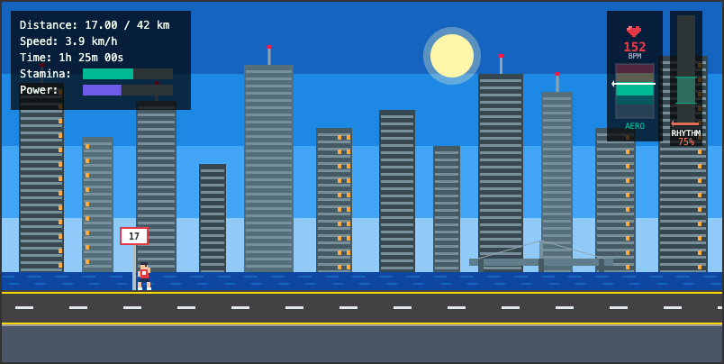
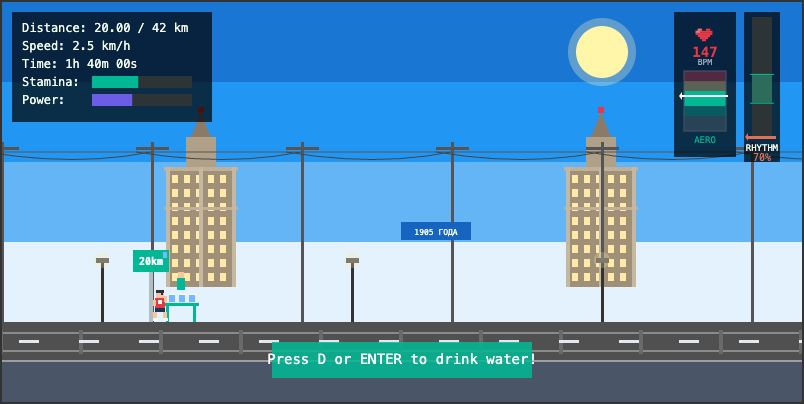
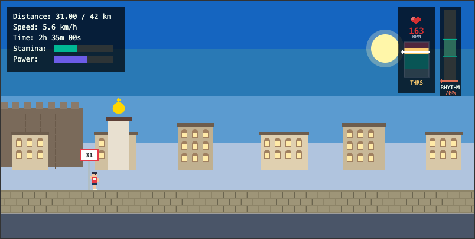
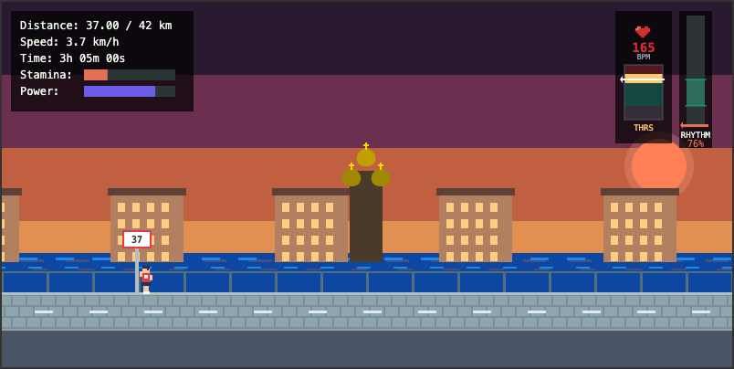
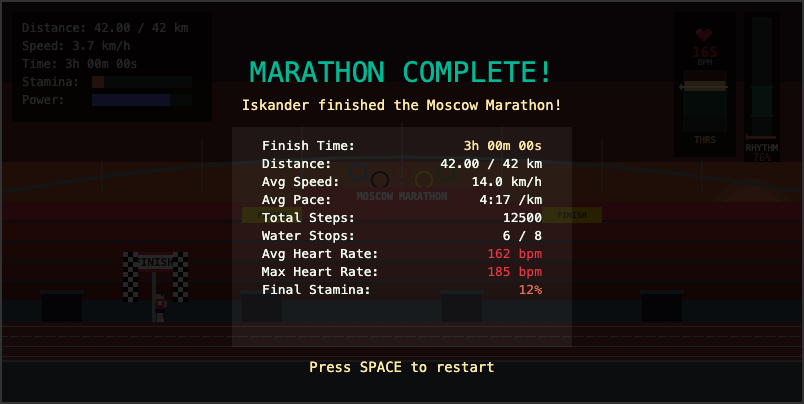

# Iskander Marathon Runner

A browser-based 42km Moscow Marathon simulator. Tap SPACE to make Iskander run through pixel-art Moscow landmarks, managing stamina and rhythm over the full marathon distance.

## How to Play

Open `index.html` in any browser. No install, no build, no dependencies.

### Controls

**Desktop:**
- **SPACE** — tap repeatedly to run (frequency = speed)
- **D / ENTER** — drink water at pitstop stations

**Mobile:** on-screen RUN and DRINK buttons appear automatically.

Stay in the green **Rhythm Zone** for optimal efficiency.

### Mechanics

- **Stamina** — drains when sprinting, recovers when slowing down. Refill at water stations every 5 km.
- **Rhythm Zone** — an optimal tapping frequency shown on the right-side bar. Hitting the green zone gives up to 125% speed efficiency and halves stamina drain. The zone shifts throughout the race, so you must adapt your rhythm.
- **Heart Rate** — tracks your effort in real time with BPM display and HR zones (Rest, Easy, Aerobic, Threshold, Anaerobic).
- **Power** — follows a natural U-shaped curve (high energy at start and end, low in the middle). Not player-controlled.
- **Time limit** — 3 hours 20 minutes. Finish over the limit = lose. Don't finish = DNF.

## The Route

The race follows the real Moscow Marathon route through 8 pixel-art scenes:

### Luzhniki Stadium — Start (0–2 km)

The race begins at Luzhniki with the Olympic rings overhead and the running track underfoot.

### Old City Embankment (2–8 km)

Through historic Moscow streets with classic apartment buildings along the river.

### Kremlin Embankment (8–14 km)

Running along the Moscow River with the Kremlin wall and Spasskaya Tower in view.

### Moscow City (14–20 km)

Past the modern skyscrapers of the Moscow International Business Center.

### Ulitsa 1905 Goda (20–28 km)

The midway grind through wide avenues with Stalinist towers and trolleybus wires.

### Kitay-Gorod (28–34 km)

Historic quarter with old churches, fortress walls, and golden domes.

### Embankment Return (34–40 km)

Sunset run back along the river with cathedral silhouettes against the evening sky.

## Water Stations

Every 5 km, a pitstop zone appears — slow down and press D or ENTER to drink and restore stamina. Don't skip them, you'll need the energy for the final stretch.

## Finish Line

Complete the 42 km and see your race stats — time, pace, steps, heart rate, and more.

## Tech

Single-file HTML/JS/CSS. All graphics are procedural pixel art drawn with Canvas 2D `fillRect` calls. No images, no sprites, no external assets.
